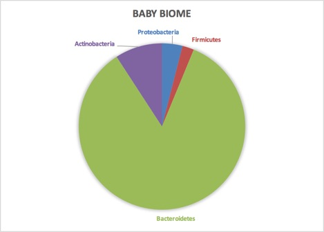

Peeking into a baby biome
---
Meet one-month-old baby girl “Ava”[^babyName]. She’s a healthy infant whose first-time parents are interested in the microbiome and have tried to do everything they can do optimize their baby’s microbial health. Ava was born vaginally, has never had antibiotics, is exclusively breast-fed by a mother who is careful to eat only nutritious, organic food. They all live in the country, surrounded by nature, including pets and other animals that will become more of her life when she starts to move around.

Her parents gave Ava an $89 [uBiome gut kit](http://ubiome.com) for her one-month birthday. As any parent on diaper duty knows, collecting the, um, sample is pretty easy. A few weeks later, uBiome gave them a list of the microbes found in the sample and a breakdown of their percentage abundances:

|  Phylum (Baby)  |        |
|:---------------|-------:|
| Bacteroidetes  | 84.59% |
| Actinobacteria | 9.18%  |
| Proteobacteria | 3.97%  |
| Firmicutes     | 2.26%  |

What does this mean? Well, the first thing to notice about Ava's microbiome is the dominance of *Bacteroidetes*, and the near non-existence of *Firmicutes*. In most westerners, the dominance of these two phyla is exactly reversed, as you can see in a similar breakdown we have of Ava’s mom:

| Phylum (Mom)    |        |
|-----------------|-------:|
| Firmicutes      | 50.40% |
| Bacteroidetes   | 23.04% |
| Verrucomicrobia | 8.66%  |
| Actinobacteria  | 7.78%  |
| Proteobacteria  | 1.59%  |
| Nitrospirae     | 0.02%  |

Both baby and mother are pretty normal so far, but can we dig deeper to learn more? Well, *“Firmicutes”* is a broad category, a bit like discussing “vertebrates” and lumping in everything from fish to people as one kind of life. Yeah, *Firmicutes* have some distinctive things in common — they mostly appear to like fat, for example — but to understand the difference between this baby and an adult, let’s dig more deeply into exactly which types of *Firmicutes* are common in her.

In most adults, *Firmicutes* seems to be a short-hand for *Clostridiales*, because that’s pretty much all you generally see in a typical *Firmicutes* sample: often something like 99% or more. Ava’s *Firmicutes* is much more interesting. Instead of  *Clostridiales* (of which she has nearly none), hers is made nearly entirely of a single species,  *Phascolarctobacterium faecium*. What does it do? We don’t really know.

Turning to the other big phyla, *Bacteroidetes*, we see it too is almost exclusively one species: *Bacteroides fragilis*, of which her mom (but not her dad) has a tiny bit as well, which makes sense because this particular bacterium is a well-known early infant colonizer, transmitted from mother to child.  Some Norwegian scientists, surveying the research, noted its well-known [immune system modulating properties](http://aem.asm.org/content/77/23/8318.full).

>*B. fragilis* are higher in children with [high specific IgE](http://aem.asm.org/content/77/23/8318.full#ref-32) (sIgE). IgE plays a central role in [asthma and allergy](http://aem.asm.org/content/77/23/8318.full#ref-34). Other studies have shown a correlation of B. fragilis with asthma and [pollen allergy](http://aem.asm.org/content/77/23/8318.full#ref-19).[^fragilis]

Now that doesn't mean Ava herself is predisposed to any of these conditions -- in fact, it may mean the exact opposite depending on the amounts or the presence or absence of other species. How little we understand is just one of the frustrating recurring themes as we study the microbiome.

Ava is fortunate to be breastfed. In fact, one clue about the importance of baby microbes is *human milk oligosaccharide* (HMO), which after fat and lactose is the most abundant element in breast milk[^breastmilk], yet its chemical structure is so complex that it's indigestible! In fact, early designers of infant formula tried somewhat arrogantly to market their wares as "scientifically" better *because* it was simple enough for a baby. But HMOs aren't there to feed the baby; they nourish the abundant microbes in the infant gut, mostly the *Bifidobacteria*, and later the *Bacteroides* that will play a role when it comes time for the baby to begin eating solid foods.

Interestingly, when I looked closely at the phyla level, I couldn't find a single microbe that was present in Ava but not in her parents, while I found plenty of examples of the opposite. I guess that's one clue of just how dependent Ava is on her mommy.

One microbe that doesn't appear in Ava's sample is *Lactobacillus*, which is often missing in collicky babies[^collicky]. Fortunately Ava seems completely normal for now but this is something to watch for in future tests. This may be an easy one to fix as well: get her a sibling. Babies who grow up in homes with other small children tend to have more diverse (and healthy) microbiomes. [^siblings]

Do you know somebody with a newborn baby? Since they'll be changing diapers regularly anyway, why not get them a uBiome gut kit so they can learn more too -- and contribute to the scientific understanding of the microbiome.

[^babyName]: Not her real name, to protect the privacy of baby and parents.

[^breastMilk]: It takes up to 500 calories per day for a mother to produce enough breastmilk to feed a child (pregnancy takes only an extra 300), so nature is apparently very serious about getting this right.

[^fragilis]: Bjerke, G A, R Wilson, O Storrø, T Øyen, R Johnsen, and K Rudi. 2011. “Mother-to-Child Transmission of and Multiple-Strain Colonization by Bacteroides Fragilis in a Cohort of Mothers and Their Children.” Applied and Environmental Microbiology 77 (23): 8318–24. doi:10.1128/AEM.05293-11.

[^collicky]:de Weerth, C., S. Fuentes, P. Puylaert, and W. M. de Vos. 2013. “Intestinal Microbiota of Infants With Colic: Development and Specific Signatures.” PEDIATRICS 131 (2): e550–58. doi:10.1542/peds.2012-1449.

[^siblings]: Penders, John, Kerstin Gerhold, Ellen E Stobberingh, Carel Thijs, Kurt Zimmermann, Susanne Lau, and Eckard Hamelmann. 2013. “Establishment of the Intestinal Microbiota and Its Role for Atopic Dermatitis in Early Childhood.” The Journal of Allergy and Clinical Immunology 132 (3): 601–7.e8. doi:10.1016/j.jaci.2013.05.043.