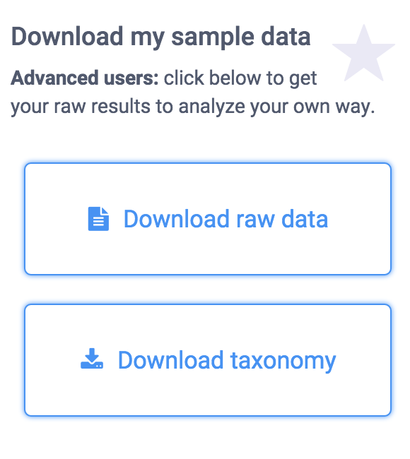
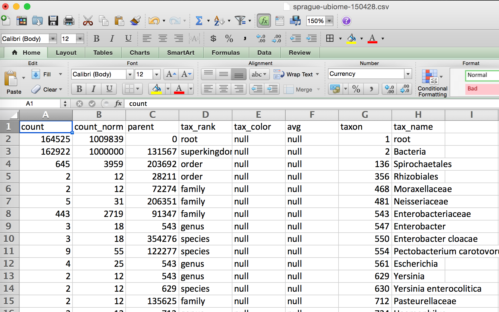
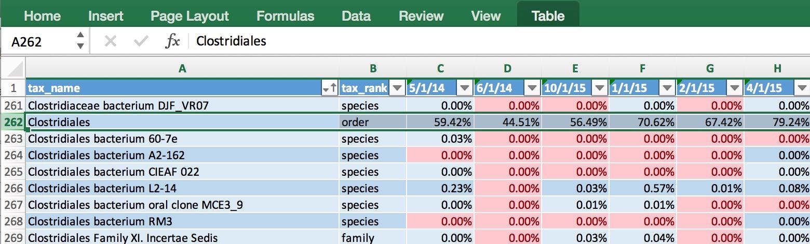
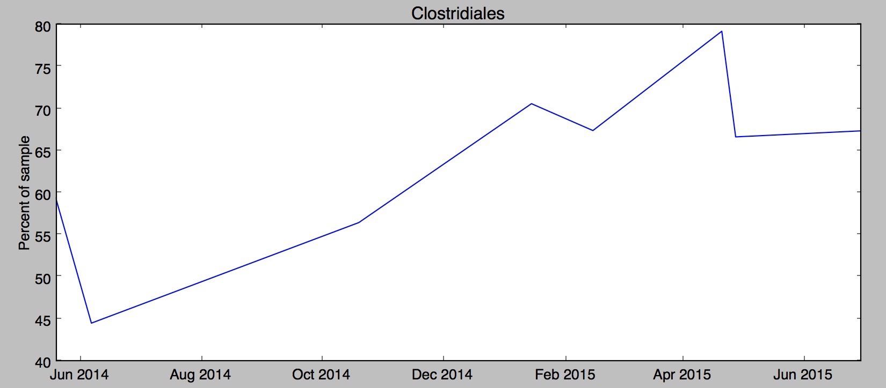

## Converting to Excel ##

The Illumina machines spit off huge amounts of data (FASTQ files can be hundreds of thousands of lines long), so to be useful you’ll need a summary. UBiome provides a much more concise version called a “raw taxonomy” file, which is generally only a few hundred lines showing just the organisms they think they found in the sample.

What is JSON
UBiome’s taxonomy files come in a simple structured text format called JSON (JavaScript Object Notation), commonly used across the web. Although it’s not as convenient for people as the rest of the uBiome web site, programmers refer to JSON as “human readable”, because if you squint enough you can sorta tell what it means without a computer program. Here’s a sample:

	{
	  "ubiome_bacteriacounts": [{
	    "taxon": "2",
	    "parent": "131567",
	    "count": "22691",
	    "count_norm": "1000000",
	    "avg": null,
	    "tax_name": "Bacteria",
	    "tax_rank": "superkingdom",
	    "tax_color": null
	  }, {
	    "taxon": "1239",
	    "parent": "2",
	    "count": "15414",
	    "count_norm": "679300",
	    "avg": null,
	    "tax_name": "Firmicutes",
	    "tax_rank": "phylum",
	    "tax_color": "5E6591"
	  }

JSON is just structured data. That’s it.  The data is organized according to keys and values. The keys are unique identifiers and the values are their values. The whole file looks that way. The only requirement of a JSON file is that it be consistent with this pattern, because after all it will need to be read by a computer eventually.
The uBiome Taxonomy JSON files identify the key ```uBiome_bacteriacounts``` which is mapped to a bunch of fields, each representing a particular organism found in your sample. Look at the figure above to get the basic idea.

Because uBiome JSON files are well-structured, it’s easy to process them with other software, including Excel. That’s our next step: bring this data into Excel.

Converting uBiome taxonomy JSON to Excel

If you just have one or two files, it’s easy to bring uBiome taxonomy data into Excel. Go to the uBiome apps page and click on the section labeled “Download taxonomy”.





You’ll see a page of JSON representing what uBiome found in your sample.


On a desktop computer, if you select-all (press control-A or command-A) then you can copy this data to the clipboard to prepare to paste it to another web site.

There are many web sites that will convert JSON to a format that will work in Excel. Google “Json to Excel” or “Json to CSV” and you’ll find one. Just paste your data into one of those sites to convert it for either Excel’s native (XLS or XLSX) format, or the more universal CSV format, readable by Excel. Here are a few of the sites I’ve tested:

http://www.convertcsv.com/json-to-csv.htm

http://www.json-xls.com/json2xls

Once the data is in Excel, you can work with it just as you would with any Excel data sheet. Here’s how one of my recent uBiome taxonomy files looks in Mac Excel:



Yours may look slightly different. Sometimes uBiome changes the labels on the taxonomy slightly, and the ordering of the columns may be different depending on how the JSON was converted, but none of that matters. The key is that you are now able to work with it in a full-blown spreadsheet.

The uBiome data tags
Let’s review the meaning of each of the columns. The uBiome JSON taxonomy data includes the following fields:

The uBiome JSON taxonomy data includes the following fields:

**count**: an absolute measure of number of organisms found in the sample. Without knowing the size of the sample, or how many times the DNA inside was processed through PCR amplification, this number doesn’t mean much except in relation to other counts at the same taxonomical rank.

**count_norm**: a “normalized” version of the count, created by simply dividing the count on a given row by the count found on the row with tax_name = Bacteria and then multiplying by one million. It’s easier to just think of it as parts per million: each unit is 1 / 10,000th of a percent. For example, if you see a row with count_norm = 500,000, you can just think of that as 50% of the sample.

**tax_name**: this is the classification of the organism based on the level of its taxonomy. If you were looking at a human being, for example, you would see homo sapiens if you selected tax_rank = species, but you’d see mammalia if you selected tax_rank = class.

**tax_rank**: tells the level of the taxonomy. In daily conversation about animals or plants, we usually refer to the species (e.g. homo sapiens), but sometimes it’s more useful to talk about bigger groupings of related organisms. For example, humans are members of the class mammalia, along with tigers and horses. If this spreadsheet were counting organisms at the level of class mammalia, the count_norm would almost certainly be bigger than the count_norm for humans alone, unless humans were the only type of mammal found in the sample.  

**taxon** and **parent**: these help identify the ranking in a more precise way by pointing out which tax_ranks are subsets of which. For example, Bacteroidia above has a parent = 976, meaning that it is a subset of the taxon 976, Bacteroidetes. When you follow the various taxons and parents up the chain, you’ll see they all end in the superkingdom Bacteria, which has a taxon of 2. The values for these numbers, incidentally, are taxonomical numbers from the curated database at NCBI, the national bioinformatics center run by the U.S. government. Enter the number into the taxonomy browser at the NCBI Taxonomy Browser and you can learn as much as you want about that organism.

**tax_color** doesn’t matter for this anaysis, but uBiome software uses this to colorize their pretty graphs to make them more readable.

Of these fields, the most important ones are **tax_name**, **tax_rank**, and **count_norm**. 


---

## Comparing samples


The uBiome JSON taxonomy file is extremely helpful at giving you a short summary of what you care about most in a sample: the organisms within it and their relative amounts. But even with these annotations, there’s a limit to what you can learn in a single sample. To be able to start hacking your microbiome, you will need to learn how to compare multiple samples.

There are two main things you’ll want to measure when comparing two samples:


**Uniqueness**: which organisms are found in only one sample and not the other? If you are comparing two samples from the same individual (e.g. Yourself), then uniqueness is another way of talking about either extinctions (when a taxon has disappeared entirely in a later sample) and appearances (when a new taxon magically shows up). In other words, you care a lot about the order in which the samples were taken.
On the other hand, if you’re comparing two separate individuals, then the ordering of the samples doesn’t matter. Uniqueness just tells which organisms are unique to a specific person.

**Relative abundance**: which person has more of which organism? There are two senses in which we care about the relative frequency of an organism’s occurrence in a sample. You might care, among all the taxons found, which ones are more highly represented in absolute amounts?  Or you might care on a relative basis. To help understand why this matters, it may help to think of the following specific example:
In many Americans the phylum Firmicutes makes up a majority of the sample, often reaching 60% or more. You might find two people, one who has 60% Firmicutes and the other with 30% — only half as much. The relative difference is 2x and the absolute difference is 30 percentage points.

On the other hand, you might find Bifidobacterium makes up 10% of the first sample and 5% of the second. In this case, the relative difference is 2x — just like the Firmicutes case — but the absolute difference is only 5 percentage points, much less than in the first example. 
The built-in uBiome web tools look for relative differences. A taxon might be a minuscule component of both samples, but when you start from a small base, even a few additional organisms can make up a big percentage change. In the extreme case, a sample with a count_norm of 100 compared to another sample with a count_norm of 300 will show a 3X increase — very high in aBiome terms, even though the absolute difference is only 300 - 100 = 200 organisms.

Compare that with a an organism with a count_norm of 50,000 in one sample and 51,000 in another sample. UBiome’s algorithms will treat these as a virtual tie, even though the absolute number of organisms in the second sample outnumber the first by 1,000 organisms.

Which method of measuring is better? It depend on what you care more about.  Some species need have only a tiny representation in a sample to make a big difference in health outcomes. 

I prefer to use both methods of measurement: absolute number changes matter for the most popular taxons, and relative amounts matter more for the less-popular ones.


----

## Comparison over time ##

#All my uBiome results in a single table

I often read news about a fresh scientific discovery involving the microbiome and immediately wonder if the discovery applies to me. For example, I recently saw a study from Oregon State University that seemed to find a link between high sugar diets and “cognitive flexibility”, i.e. your ability to adapt and adjust to changing circumstances. The study’s author, Kathy Magnusson, a professor in the OSU College of Veterinary Medicine, found that mice who eat lots of sugar have elevated levels of Clostridiales bacteria, and that this seemed to relate to a slower ability to solve a maze. Hmmm, I thought — how much Clostridiales do I have?

If you have just one uBiome result, that’s easy:

log into http://app.ubiome.com and search for it in the section “All My Bacteria”. (As far as I know there’s no “search” button yet on the uBiome dashboard). But in my experience a single result doesn’t tell you much. You really need at least two and hopefully several uBiome results to see what might be actionable. In my case, I want to know how my Clostridiales may have changed over time.

I programmed a short Python script to generate a single Excel table with every bacteria I’ve ever found, and then a series of columns with the amount found in each sample. Something like this:


The data makes it easy to generate a chart showing how my Clostridiales changes over time:


Hmmm, in my case it looks like something happened since last fall to increase my Clostridiales levels. Maybe it was the potato starch I tried in order to hack my sleep? Was it my trip to Central America in February? And of course the biggest question: has the increase affected my cognitive flexibility? I’m not really sure. Whatever happened, the level of Clostridiales seems to have stabilized in the past couple of months.

uBiome has identified more than 900 unique taxa (groups of organisms) in the half-dozen samples I've submitted over the past year, and after running this script I have them all laid out on a single page. Now, armed with this one spreadsheet I can search anytime for a new microbe and quickly see if I have it now, or if it's ever been detected in a previous test. Reading news about microbiome has taken on a whole new personal meaning when I can see if the discovery relates to me.

If you know a little Python, you can make the same spreadsheet with your samples using the ubiome.py Python module on the ubiome-opensource GitHub repository; the script that generated my spreadsheet is there too as an example. And while you’re at it, please upload your own uBiome sample results to the same repository so we can compare.

----


[OverallSampleJun16.jpg]: OverallSampleJun16.jpg width=1024px height=560px

[OverallSamplePieJun16.jpg]: OverallSamplePieJun16.jpg width=483px height=445px

[YourSampleVsAllSamples.png]: YourSampleVsAllSamples.png width=936px height=364px

[uBiomeScreenDownloadData.png]: uBiomeScreenDownloadData.png width=290px height=325px

[uBiomeScreenShotTaxonomyJSON.png]: uBiomeScreenShotTaxonomyJSON.png width=471px height=225px

[ExcelScreenOverview.png]: ExcelScreenOverview.png width=505px height=312px

[ubiomeExcelMultiTable.jpg]: ubiomeExcelMultiTable.jpg width=780px height=236px

[ubiomeExcelClostridiales.jpg]: ubiomeExcelClostridiales.jpg width=825px height=362px
