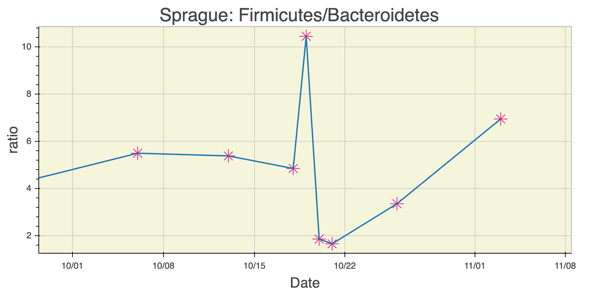

#Experiment: Gut Cleanse
Your gut microbiome changes constantly in response to everything from diet to exercise, so when looking at multiple uBiome test results side-by-side it can be complicated to figure out what caused a particular change. What if you could wipe the slate clean; start over with a completely new biome and just track *that,* along with precisely what you eat afterwards? What could you learn?

I recently tried exactly that, using a colon cleanse – the kind you do before a colonoscopy screening. By flushing all the bacteria from my system and carefully watching them grow back with side-by-side uBiome tests, I learned a few things that might interest you as well:

**My gut microbiome recovers pretty quickly.** Unlike antibiotics, which are known to cause long-term (and possibly permanent) changes, losing bacteria this way seems only to affect the total numbers, but they sprout right back just like a haircut. In two weeks I was as good as new.

Here’s the the summary from uBiome:

Notice the big change on the day of the cleanse, followed by a big shift back to normal just a day later.

**Amounts and ratios changed, but not the specific organisms**. Of course I lost a bunch of bacteria – that was the point – but surprisingly I didn’t seem to gain anything really new, even after an aggressive attempt at re-seeding. I didn’t gain or lose a single phyla. Other than amounts and ratios, I had to dig down to the Class level of the biological hierarchy to find anything that was permanently lost, and even at the very fine-grained Genus level, only two taxa that had been regularly present beforehand were now extinct. (*Holdemania* and *Methanomassiliicoccus*).

Here's a look at the key Phylum measure [we discussed previously](explore.md) that summarizes how my overall microbiome fared:

**A couple of weird ones, at small amounts, made a brief appearance.** I was especially intrigued by five new taxa that showed up just once, the day after the cleanse, and then disappeared. Maybe I found some that ordinarily get lost in the noise of the microbiome and only show up when the rest of the forest has been cleared. These are some hardy guys and I’m glad I know their names and can watch for them again: *Abiotrophia, Bacillus, Catonella, Christensenella, Parvimonas*.

**It’s pretty hard to make a significant change.** These days a little googling will find plenty of web sites, books, diets, and supplements that claim to “fix” or “change” your microbiome. I’m a healthy, reasonably fit adult, so I’m not as motivated as somebody with a specific health problem, but I thought simply popping probiotics and eating a variety of new and fermented foods would have a big effect. Nope. There are exceptions – my past experience with [sleep hacking](http://www.ubiomeblog.com/my-ubiome-sleep-hacking-update/) demonstrated conclusively to me that I can temporarily change my bifidobacterium levels for example – but those are harder to find than I had hoped.

Here's another important ratio [discussed here] that microbiologists have found useful to see how the gut biome changes:

See much change?  Me neither. There's a short spike during the cleanse, but then it just pops back to normal.

