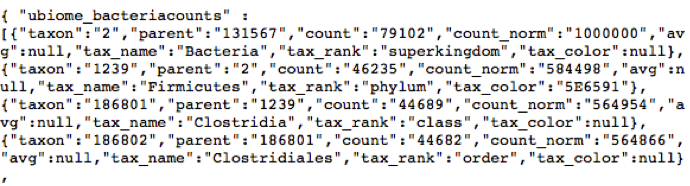
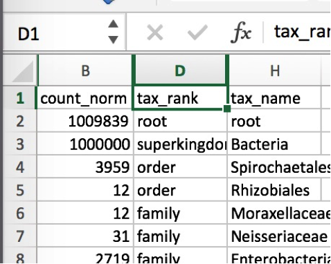
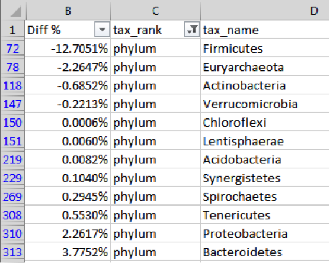
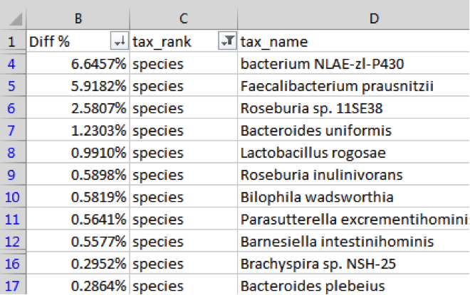
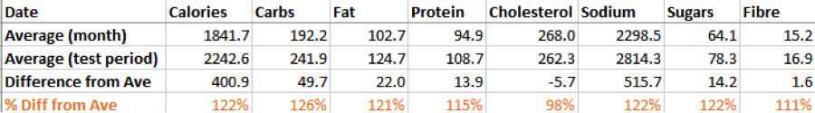
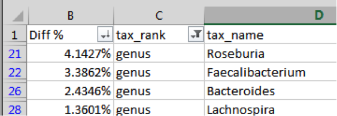

Experiment 1: How does food affect my microbiome
------------------------------------------------

Let’s start with a simple example involving food. These experiments are the easiest and often the most insightful because food intake is so easy to manipulate: you either eat the specific item you’re testing or you don’t. Also, this is the type of comparative diet that nutrition scientists conduct all the time, and often you can compare your results and methods to experiments that have already been performed. You could test how your gut responds to a particular type of food, like gluten or alcohol, or you can test different diets: vegetarian vs. omnivore, conventional versus organic, artificial sweeteners versus ordinary sugar. One big advantage of testing on yourself is that, rather than hope to extrapolate from a study done on other people, you’ll know how these diets affect *you*.

A good experiment should reduce or eliminate as many external variables as possible. Ideally, if I were testing gluten for example, I would pick a time period when everything about my life is identical except for the gluten I eat. Unfortunately, few of us have lives where we can be so precise about what’s changed and what hasn't. For that reason, the purpose of my first experiment is simply to establish a baseline. I’ll eat my “normal” diet, with no particular intervention one way or another. This will give me a rough idea of the background noise that I can compare with results from future experiments.

Since the purpose of my test is to measure the effect of diet, I’ll carefully track not only everything I eat during this period, but what I ate for the week or two beforehand as well.

To track food, I use the (free) app MyFitnessPal <http://myfitnesspal.com> , on my iPhone (versions are available for Android and web too). There are many other, similar apps, but I like MyFitnessPal because it has by far the largest food database. Its massively crowd-sourced data includes bar code scan information for just about any packaged food product, so most of the time I simply point the phone at an ingredients label and it automatically computes all the nutritional information. Importantly, I can then export all my detailed nutritional information to a CSV file or spreadsheet for later analysis.

I chose to do my tests from Sunday to Sunday, carefully tracking several weeks of nutritional data before, during, and after. After submitting my samples by mail, it takes about 6 weeks to get results. At that point, just log into the uBiome web site and download your raw information. Here’s how:

First, click the “Download taxonomy” button on [the web page for your sample](http://app.ubiome.com).




Although it will look like gobbley-gook, you can turn this into an Excel spreadsheet easily enough following the techniques in the chapter “Analyze your microbiome in Excel”. At that point, you’ll have a spreadsheet with three columns: “count\_norm”, “tax\_rank” and “tax\_name”:




Then it’s a simple matter of running some standard Excel filtering operations on the fields, as explained in the previous chapter. Filter tax\_rank by “Phylum” and then sort the count\_norm field from largest to smallest. The count\_norm numbers correspond to parts per million – just divide by 10,000 to get the percentages.

By the way, a big bonus awaits you in the taxonomy file that you can’t get from the standard web page: species information. [Most scientists trust] the 16S rRNA technology down to the genus level, but there is more uncertainty at the species level, so uBiome doesn’t publish it to the web page. Drag it into Excel, though, and you can make up your own mind about whether you trust the species info or not.

Next go to [the Github page for this book] and download ubiome.py. If you have the Python language on your computer (all Macs come with it built-in), you can run this file without installing anything extra. See the appendix for a quick summary of what you’ll need to know to get started.

In my case, I have two samples that I’ve downloaded to my computer. The first, ```before.JSON``` is the taxonomic information from the start of my experiment. The file from the sample taken one week later is called ```after.JSON```. Let’s see what changed during the week.

On a Mac, open Terminal and run the following command:

    python ubiome.py –u before.JSON after.JSON &gt; extinct.CSV

The –u switch tells the script to identify from the two samples only those organisms that are unique to the first sample. The new file, extinct.CSV contains just those organisms, i.e. the ones from the sample before, but not in the later one. In other words, these are the organisms that went extinct during the week-long trial.

Similarly, the following command will give you a file that contains the relative differences between every organism in before and after.

    python ubiome.py –c before.JSON after.JSON &gt; diffs.CSV

This time, the –c switch tells the script to compare the two samples and return the differences between them. Opening the file diff.csv, I find this:




Negative numbers indicate a drop from the first sample; positive numbers mean the amounts increased at the second test. In this case, I’m seeing a large drop in the phylum Firmicutes at the end of the week, with a small increase in Bacteroidetes.

Incidentally, these differences would normally sum to zero, but in this case they clearly don’t. Why not? The reason is that the later sample has an increase in unidentified organisms, adding up to about 8% of the entire sample – accounting for the difference. It’s not uncommon for the 16S analysis to be unable to identify 5-10% or more of a sample. So much about the microbiome is still unexplored, and this is one example.

Here’s another look, this time at the species level:



In this example, I see a large increase in ***Faecalibacterium prausnitzii***, often considered a marker for health (see the discussion in the section “Organisms to Watch”). I’ll want to look at my meals over the test period to see what might have driven this positive change.

Using the macronutrient data I collected daily with MyFitnessPal (exported to CSV with the handy exporter at <https://www.designbyvh.com/myfitnesspal-export-data/>) I produced this simple chart to see if my eating habits had an effect on my microbiome:



As you can see, though I apparently ate about 20% more overall during the week of my test, my dietary cholesterol was conspicuously lower than normal. Did this affect my microbiome?

To find out, I searched the medical and biology literature to see if there are known relationships between dietary cholesterol and *Faecalibacterium*. A simple Pubnet search for that taxa and “cholesterol” brings several hits, including one from a paper published in BMC Genomics[^1], about patients with cholesterol gallstones. Note this key result from the summary:

* there were significant (P &lt; 0.001) increases of gut bacterial phylum Proteobacteria and decreases of three gut bacterial genera ,Faecalibacterium, Lachnospira, and Roseburia. *

I’m not a doctor, nor do I pretend that this has any medical consequences, but when I look at my own changes for the week, I see the following genera:



Is it a coincidence that the very specific bacterial genera that are mentioned in a paper linking cholesterol to the gut biome *are the same ones that changed* in a week in which I ate less dietary cholesterol than normal? Did I find something new? That’s the exciting part about this type of citizen science: armed with my own data and imagination, new discoveries are everywhere. 


[^1]: Gut microbiota dysbiosis and bacterial community assembly associated with cholesterol gallstones in large-scale study http://www.ncbi.nlm.nih.gov/pubmed/24083370
