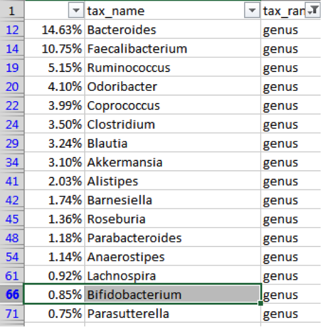
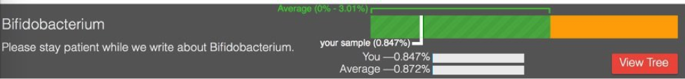
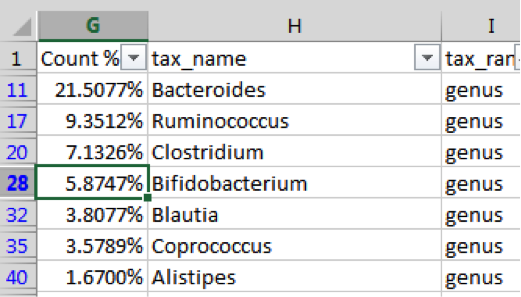

Experiment 3: Hacking my sleep
------------------------------

Measuring before and after a change is a nice way to see how my microbiome adjusts to circumstances, but what happens if I try to manipulate the microbiome to achieve a specific result? This experiment will try to do exactly that.

Martin Blaser’s excellent book about the microbiome, *Missing Microbes*, mentions that most (80%) of the precursors to the sleep- and mood-regulating neurotransmitter serotonin [are made in the gut]. Could my gut microbes affect my sleep?

A quick internet search for “gut microbe serotonin” will lead you to  [B. infantis, which modulates tryptophan], the stuff in turkey that urban legends have long blamed for [that sleepy feeling] you get after Thanksgiving dinner. This seems like a good target to check, so my first step was to look at my gut biome results to see my levels of the *B. infantis* parent genus *bifidobacterium*.

How do I tell whether 0.85% is a “normal” or not? uBiome offers this view to compare yourself to the others in their database:

Looks like I’m much lower than average. A search through the rest of the sheet shows that I have no measured amount of *B. infantis*. The 16S testing for a specific species can be unreliable, so I won’t take that as a definitive no, but it clearly leaves some room for improvement.

How can I improve my overall *Bifidobacterium* levels? It helps to understand something about the bacterium itself, at all its levels. Fortunately, it’s a well-studied organism, first identified back in 1899 as a common inhabitant of the intestines of breast-fed infants. Nowadays you can buy prebiotics that contain lots of bifido – or so they claim. Without rigorous lab independent verification of the claims, it can be hard to tell if the prebiotic form is helpful or not. (In fact, that may be a good experiment)

Bifido is highly sensitive to oxygen, and flourishes best in environments like the colon that are anaerobic. It’s also a strong fermenter of certain types of starches, called resistant starch, so-called because they resist digestion.

One of the best resistant starches is plain old potato starch, made by finely grinding tubers into a light, white powder. You can buy an organic version from *Bob’s Red Mill* at most natural foods stores or high-end supermarkets. It’s cheap, and tasteless, so it’s often used in cooking, as a thickener for sauces.

The nutrition label on potato starch shows that it is essentially inert as a food. No calories, vitamins, or minerals, no fat, and not even any fiber. It’s just zero on everything, because it passes right through the stomach. When cooked, it becomes a thick, gooey consistency that quickly is absorbed by powerful stomach acids, but if kept in its raw state, it slides right through into the colon.

Not many other foods make it this far undigested, so a rich unfermented wad of fresh potato starch is a real treat for the Bifido of the colon and they quickly begin to make the most of it, fermenting it into the precursors to tryptophan.

For this experiment I started with two tablespoons the first day, and then three tablespoons the next. Anything larger might risk unpleasant gas or loose stools until my body adjusts. Within two days, though, it was obvious that something was working. I couldn’t believe my excellent sleep that first couple of nights.

After a few days, the sleep effect started to wear off, though I still felt much-improved. But could I trace the improvement to improved levels of Bifido? To find out, I measured myself again:

Bifidobacterium is *much* higher! I raised my bifido levels by almost 7 times.

The other genera changed as well, but among the top taxa, the Bifido change was clearly the most significant. For more proof, look at this chart showing all the samples I took before and after my potato starch experiments.

Clearly, something significant changed when I added potato starch to my diet.
