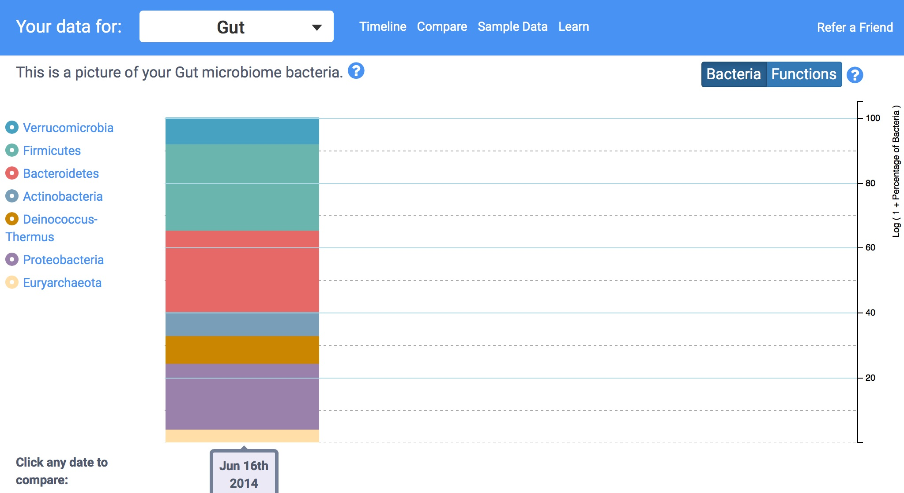
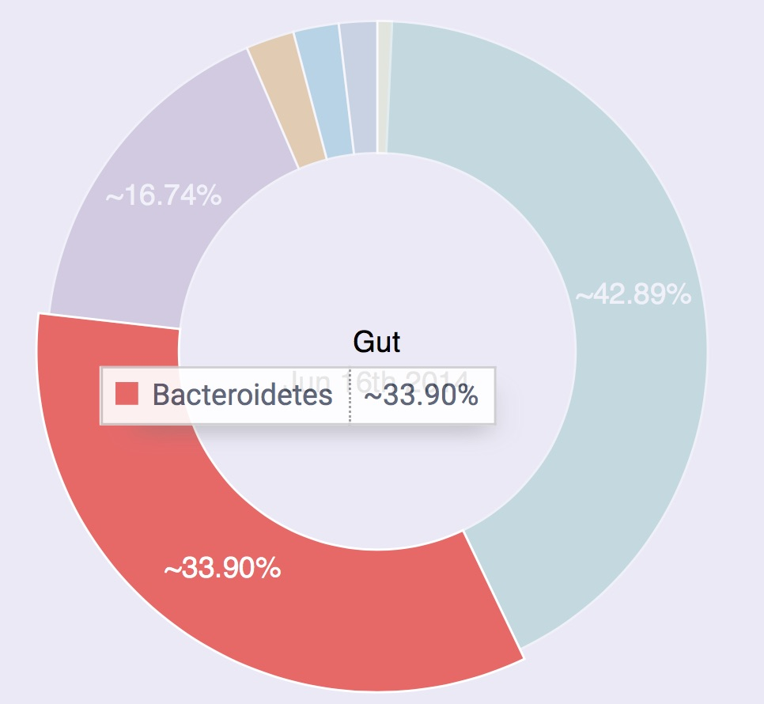

Getting Started
===============

You just received an email that uBiome has finished processing your sample. Now what do you do?

The first stop of course is the [*uBiome web dashboard*](http://app.ubiome.com/), where you’ll see an overview of your results. The instructions there are self-explanatory and you’ll learn most of what you need to know by simply clicking around. The following explanation will help you dig deeper.

If you only have one sample, your page will look something like this:

Figure : Overview of June Sample

This colorful bar chart is your first high-level glimpse of the bacteria found in your sample. Hover over it with your mouse (or tap with your finger if you’re on a phone or iPad), to see a pop-up view of the approximate percentages.

You’re seeing a *phyla*-based look at your microbiome. This is a very high level view, a bit like how a Martian might see life on earth from far in outer space. Keep in mind that by “very high level”, I mean *very* high, the equivalent of seeing life only at the level of “vertebrate” and “invertebrate”. You don’t even bother separating fish from one another or for that matter, from land animals: just lump all of them together. At the phyla level, mammals, reptiles, fish – they’re all the same. Similarly, when you see the phylum *Firmicutes*, for example, think of it as having as encompassing as much variation as all the vertebrates, from those on land, in the ocean, big, small, harmless, dangerous and everything in between. In other words, this first approximation is pretty crude.

Now scroll down to see the same data represented in a pie chart.

This time the various phyla *are* represented as percentages of the whole, so some of them are relegated to tiny slices of the pie. That doesn’t necessarily mean they’re unimportant, though, because in the world of life, even some tiny populations can exert an outsized influence.

Remember too that so far we’re treating each individual organism as if it’s the same size as the others, but that’s an oversimplification too, just like it would be a mistake to assume that elephants matter more because they’re bigger than humans,

All we know at the phylum level is that proportionately, certain large classes of bacteria are more well-represented than others. That may not sound like much to go on, but as we’ll see, scientists have been able to learn quite a bit from tiny clues like this.

The most common phyla
=====================

Most westerners will find their sample dominated by two phyla: *Firmicutes* and *Bacteroidetes*. These are so common in healthy people that it’s tempting to assume that it’s supposed to be that way, but like much else with the microbiome, the situation is different outside the western world, a clue that it’s difficult to summarize a single individual’s microbiome as “good” or “bad.” It all depends.

**Firmicutes** is usually the most common, and for good reason: it’s very good at sucking energy out of the types of high-fat, highly-processed food we eat in industrialized societies. For that reason, some scientists think it may be associated with obesity because you don’t need to eat as much to extract the same amount of energy from food. On the other hand, it’s not hard to find skinny people with lots of Firmicutes, so this theory doesn’t always hold, but it’s worth asking the question.

**Bacteroidetes** is not as good at digesting fat, so it sticks to high-fiber foods like those in vegetables, which is why vegetarians tend to have high levels of this phylum. It’s often most prominent outside the industrialized world, too, where people eat less meat.

**Prevotella** tends to be more prevalent among high-carb eaters.

**Proteobacteria**: 
If you’re an otherwise normal omnivore and see double-digit amounts of this it can be a sign that your body was recently under attack. For example, in one of my tests I had 14% Proteobacteria, which often is elevated in people with gastric disorders like Crohn’s disease. That doesn’t mean that Proteobacteria is *bad*; in fact, it could mean the opposite, that we need more of these to fight back invaders. In my case the unusually high amount came right after a long trip to Central America, during which my body was exposed to many new and possibly pathogenic microbes. My Proteobacteria fell soon after I returned to the U.S. and my normal diet.

How are you different?
======================

[^1]: De Filippo, Carlotta, Duccio Cavalieri, Monica Di Paola, Matteo Ramazzotti, Jean Baptiste Poullet, Sebastien Massart, Silvia Collini, Giuseppe Pieraccini, and Paolo Lionetti. 2010. “Impact of Diet in Shaping Gut Microbiota Revealed by a Comparative Study in Children from Europe and Rural Africa.” *Proceedings of the National Academy of Sciences of the United States of America* 107 (33): 14691–96. doi:10.1073/pnas.1005963107.

[^2]: Cho, Ilseung, and Martin J Blaser. 2012. “The Human Microbiome: At the Interface of Health and Disease.” *Nature Reviews. Genetics* 13 (4): 260–70. doi:10.1038/nrg3182.
