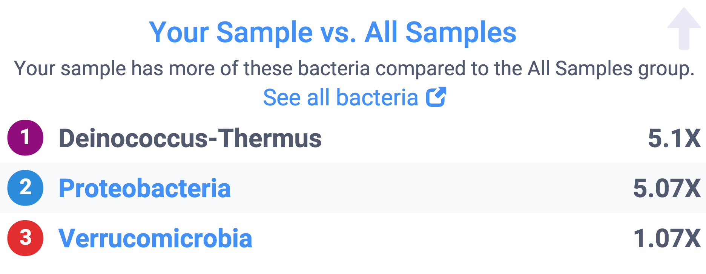

# Getting Started

Let's jump right in with a specific example.

You just received an email that uBiome has finished processing your sample. Now what do you do?

The first stop is the [_uBiome Explorer web dashboard_](http://app.ubiome.com/), where you’ll see an overview of your results. The instructions there are self-explanatory and you’ll learn most of what you need to know by simply clicking around. The following explanation will help you dig deeper.

If you only have one sample, your page will look something like this:

Figure : uBiome Explorer Insights Overview

That's the Insights pane, designed to tell you the highlights. If this is your first time here, go ahead and breeze through this page, but don't get caught up on details. As we'll learn, scientists have barely scratched the surface of what we will eventually understand about the microbiome, so think of this page as a teaser -- a hint of the potential. If your results show something you didn't expect, say on diversity or body weight, don't worry: it almost certainly just means that the Insights pane is wrong about you. Later we'll see how to pull out far more interesting and useful results.

Click next on the "My Bacteria" tab. The colorful pie chart there is your first high-level glimpse of the bacteria found in your sample. Hover over it with your mouse (or tap with your finger if you’re on a phone or iPad), to see a pop-up view of the approximate percentages.

You’re seeing a _phyla_-based look at your microbiome. As [we'll learn in more detail later](science.md), this is a very high level view, a bit like how a Martian might see life on earth from far in outer space. Keep in mind that by “very high level”, we mean _very_ high, the equivalent of seeing life only at the level of “vertebrate” and “invertebrate”. The incomprehensible diversity of bacterial life means that at this level, you don’t even bother separating fish from one another or for that matter, from land animals: just lump all of them together. At the phyla level, mammals, reptiles, fish – they’re all the same. Similarly, when you see the phylum _Firmicutes_, for example, think of it as having as encompassing as much variation as all the vertebrates, from those on land, in the ocean, big, small, harmless, dangerous and everything in between. In other words, this first approximation is pretty crude.

This time the various phyla _are_ represented as percentages of the whole, so some of them are relegated to tiny slices of the pie. That doesn’t necessarily mean they’re unimportant, though, because in the world of life, even some tiny populations can exert an outsized influence. A wolf is just one of a gazillion different creatures in Yellowstone National Park, but that is little comfort to a rabbit.

Remember too that so far we’re treating each individual organism as if it’s the same size as the others, but that’s an oversimplification too, just like it would be a mistake to assume that elephants matter more because they’re bigger than humans.

All we know at the phylum level is that proportionately, certain large classes of bacteria are more well-represented than others. That may not sound like much to go on, but as we’ll see, scientists have been able to learn quite a bit from tiny clues like this.

# The most common phyla

Most westerners will find their sample dominated by two phyla: _Firmicutes_ and _Bacteroidetes_. These are so common in healthy people that it’s tempting to assume this is "natural" or "normal", but like much else with the microbiome, the situation is different outside the western world, a clue that it’s difficult to summarize a single individual’s microbiome as “good” or “bad.” It all depends.

**_Firmicutes_** is usually the most common, and for good reason: it’s very good at sucking energy out of the types of high-fat, highly-processed food we eat in industrialized societies. For that reason, some scientists have claimed it might associate with obesity, since its presence might indicate a gut that is highly-optimized to pull as many calories as possible from food. On the other hand, it’s not hard to find skinny people with lots of Firmicutes, so this theory doesn’t always hold. I've seen it lower in vegetarians, and I suspect that maybe it reflects diet more than weight.

**Bacteroidetes** is not as good at digesting fat, so it sticks to high-fiber foods like those in vegetables, which is why vegetarians tend to have high levels of this phylum. It’s often most prominent outside the industrialized world, too, where people eat less meat.

**Prevotella** is associated with carbohydrates.

**Proteobacteria**:  
If you’re an otherwise normal omnivore and see double-digit amounts of this it can be a sign that your body was recently under attack. That's because Proteobacteria For example, in one of my tests I had 14% Proteobacteria, which often is elevated in people with gastric disorders like Crohn’s disease. That doesn’t mean that Proteobacteria is _bad_; in fact, it could mean the opposite, that we need more of these to fight back invaders. In my case the unusually high amount came right after a [long trip to Central America](experiment-jungleTravel.md), during which my body was exposed to many new and possibly pathogenic microbes. My Proteobacteria fell soon after I returned to the U.S. and my normal diet.

# How are you different?

Since so little about the microbiome is well-understood, most of the time it will be hard to interpret your results by themselves. This is where the power of uBiome's citizen science can help, because the web page lets you easily compare your results with other people.

That first bacteria, _Deinococcus-Thermus_ is an extremophile, usually only found in harsh environments, like the impossibly acidic human stomach. Why would I have so many more than other people like me?

One clue is the similarly-high levels of Proteobacteria, which as we just noted is often high in people with gastro-intestinal issues. Maybe I was exposed to something that released a bit of stomach acid, and its extremophile _Deinococcus_ into my colon.

_Verrucomicrobia_ is elevated too, though not by much. This is a Phylum that is generally associated with soil microbes, though it's not unusual to find it in the gut as well.

I looked back at my notes during the period of a few days before this sample, and interestingly I had been doing work in my garden at the time. We have deer and other animals that come near our house...is it possible that I was exposed to some animal excrement, maybe some of which somehow made it into my gut?

It's just a theory, and perhaps an unlikely one, but I wonder if my body was fighting some type of pathogen as a result of my outdoor activities. Now before we get too excited, keep in mind that I never felt the slightest bit ill during this period. Can I thank my microbiome? Perhaps I was exposed to something nasty, the kind of bug that under other circumstances might have wreaked havoc and left me terribly sick for days. Now I have no way of knowing for sure, but this tidbit makes me wonder if maybe my microbiome acted as a guardian angel, protecting me from something much worse.

Similarly, your own results comparing to others may lead you to clues about aspects of your environment you didn't otherwise suspect.

Incidentally, since this test I've sent dozens of additional samples to uBiome and never saw that _Deinococcus_ thing again. Good riddance? or maybe I should be thankful for the protection, and hope that little bits of it may still be present, undetectably in my stomach, waiting to fight another external enemy the next time I come in contact with something in the soil.

---

[^1]: De Filippo, Carlotta, Duccio Cavalieri, Monica Di Paola, Matteo Ramazzotti, Jean Baptiste Poullet, Sebastien Massart, Silvia Collini, Giuseppe Pieraccini, and Paolo Lionetti. 2010. “Impact of Diet in Shaping Gut Microbiota Revealed by a Comparative Study in Children from Europe and Rural Africa.” _Proceedings of the National Academy of Sciences of the United States of America_ 107 \(33\): 14691–96. doi:10.1073/pnas.1005963107.

